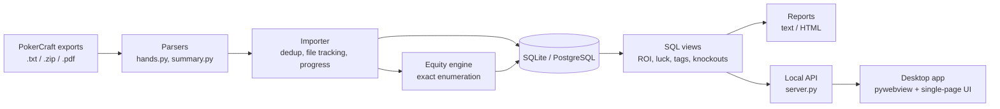

# Architecture

## Modules

| Module | Responsibility |
|---|---|
| `hands.py`, `summary.py` | Regex parsers for GGPoker hand histories and tournament summaries; chip conservation per hand |
| `importer.py` | Classifies files, idempotent loads (natural keys + `ON CONFLICT`), remembers imported files, progress callbacks |
| `equity.py` | Vectorised 7-card evaluator, exact runout enumeration, side pots, all-in detection, parallel precompute |
| `classify.py` | Tags from data only: format, stake, field size, level speed, late registration |
| `sql/schema.sql`, `sql/views.sql` | Portable DDL and analytics views (same SQL on SQLite and PostgreSQL) |
| `replay.py` | Hand replay as server-side snapshots, so poker accounting is tested in Python, not in the UI |
| `tournament_report.py`, `dashboard.py` | Report data + text/HTML rendering |
| `server.py`, `app.py`, `web/index.html` | Local-only HTTP API, background import job, folder watcher, desktop window |

## Decisions

- **Exact equity instead of Monte Carlo.** Luck is the headline number, so it must not carry sampling noise.
  Enumeration plus a suit-canonical cache keeps it affordable; distinct matchups are spread over CPU cores.
- **Everything derived from files.** No payout structures, no manual tagging: the tool has to work for a player
  who will never type anything in. That rules out ICM, which needs payouts.
- **SQLite for players, PostgreSQL optional.** Zero setup for users; the same portable SQL runs on PostgreSQL
  for anyone who wants a server (tested in CI).
- **Local web UI in a native window.** One UI for macOS and Windows, reuses the HTML reports, no frontend build
  step. The server binds to 127.0.0.1 and write actions need a per-launch token.
- **Say "unknown" instead of guessing.** Small samples, incomplete histories, unknown cards and shared knockouts
  are flagged rather than estimated.

## Testing

`python -m unittest discover -s tests -t .` covers parsers, importer, equity, classification, reports, replay and
the HTTP API. The evaluator is checked against all 2,598,960 five-card hands and an independent reference
evaluator; equities against closed-form outs counts and brute force (including a three-way side pot). CI runs the
suite on Linux, macOS and Windows and the core flow against PostgreSQL 16.
